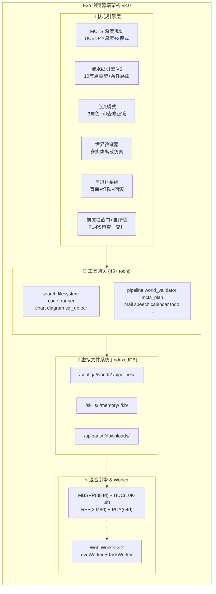
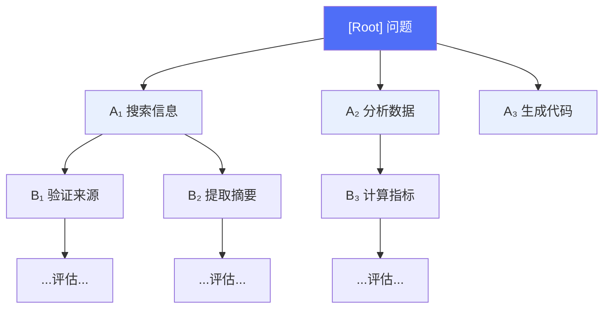
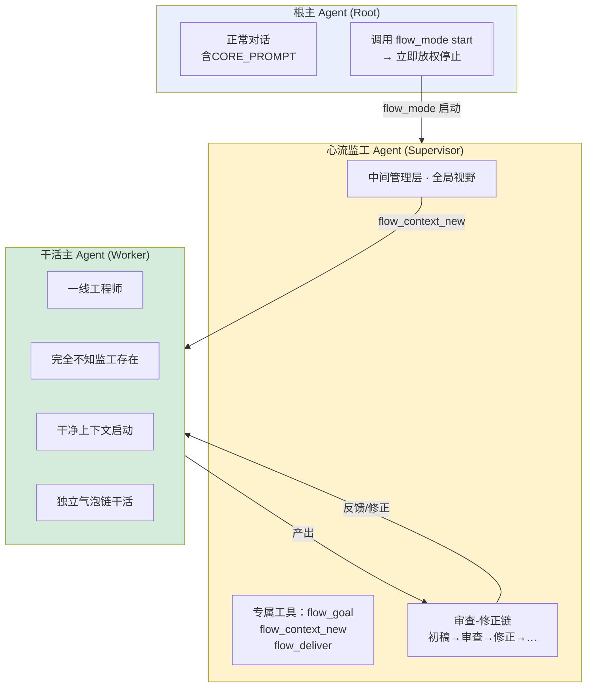
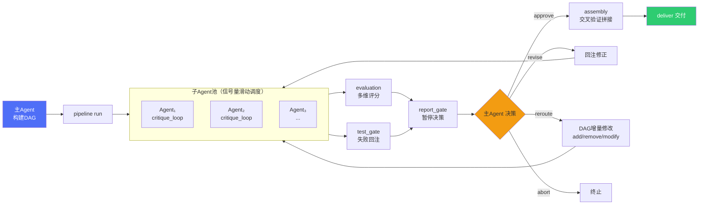
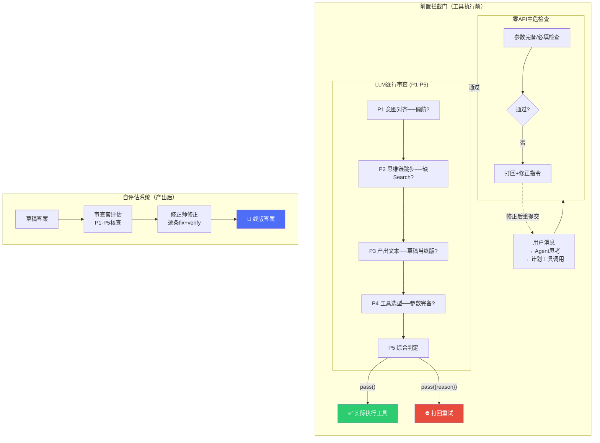
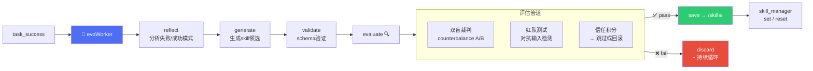

https://xiyinnnnnn.github.io/exo-mind/index.html
<!-- language-tabs -->

[ 中文](#chinese) | [ English](#english)

---

<a id="chinese"></a>

```
███████╗ ██╗       ██╗    ██████╗ 
██╔════╝  ╚██╗ ██╔╝ ██╔════██╗
█████╗         ╚███╔╝  ██║          ██║
██╔══╝        ██ ╔██╗   ██║        ██║
███████╗ ██╔╝    ██╗  ╚██████╔╝
╚══════╝ ╚═╝      ╚═╝    ╚═════╝ 
```

> 🛸 浏览器端全栈智能体。MCTS深度规划 · 流水线多Agent调度 · 世界离散验证 · 自进化技能载入 · 心流自主运行 · 逐行审查 · **你的外脑。**

**当前版本**: v2.0 (对应源码 20,854 行, 1.1MB 单HTML文件) · 纯浏览器运行 · 📍 GitHub友好 Mermaid 版

---

## 这是什么

Exo 是一个运行在浏览器中的自主AI Agent。**单HTML文件，零后端，全本地。**

它不仅仅是一个聊天机器人。它是一个完整的智能体操作系统，包含：

🔹 **MCTS 深度规划** — 蒙特卡洛树搜索，最多600次仿真，UCB1+信息素，收敛检测  
🔹 **流水线引擎 V6** — DAG编排多子Agent并行协作，10种节点类型，条件路由（复合表达式），错误降级边  
🔹 **心流模式(Flow Mode)** — 三角色模型（根Agent→监工→干活Agent），审查-修正链，自主闭环  
🔹 **世界验证器** — 多实体离散事件仿真，嵌套子状态，正交区域，守卫条件，跨实体事件  
🔹 **自进化** — 后台反思→技能生成→盲审裁判→红队测试→自动加载  
🔹 **前置拦截门(Pre-Gate)** — 工具调用前零API中危参数检查 + LLM高危逐行审查  
🔹 **自评估系统** — 草稿→审查报告→修正→交付，内置审查官+修正师双角色  
🔹 **本地嵌入引擎(MBSRP)** — 纯算法384维向量嵌入，16基稀疏随机投影，零下载  
🔹 **HYPERMEM超维度记忆** — HDC 10K-bit + RFF 2048维 + PCA 64维，三阶段混合检索  
🔹 **分支对话(Bubble Branch)** — 任意气泡分叉，嵌套分支，可视化 `< 1/3 >` 切换  
🔹 **多对话并行** — 每对话独立状态隔离，后台运行，切换无污染  
🔹 **45+内置工具** — 搜索、文件系统、代码执行、图表、SQLite、OCR、PDF、邮件、语音、日历…

---

## 架构总览



---

## 核心子系统

###  MCTS 深度规划器



**两种模式:**

| 模式 | 仿真数 | 最大深度 | 并发 | 思考 | Token预算 |
|------|--------|---------|------|------|----------|
| `fast` | 150 | 4 | 12 | ✗ | ~22M (日配额10%) |
| `standard` | 600 | 6 | 20 | ✓ | ~44M (日配额20%) |

**技术细节:**
- 混合价值函数: Q_local(单步) + Q_global(整路径) 双重信息素更新
- VL_WEIGHT 虚拟损失防止重复探索同一分支
- 收敛检测: `regret_ratio < 0.05 AND value_stddev < 0.02 AND min_root_visits >= 30`
- 资源感知: DEATH_PENALTY 惩罚高消耗路径, CYCLE_SIMILARITY 检测循环
- Token预算控制: 按日配额动态分配，穿越搜索各实例隔离

---

###  心流模式 (Flow Mode)



**核心机制:**

| 特性 | 说明 |
|------|------|
| **工具隔离** | 三层过滤：`flow_mode`(root) / `flow_goal`等(supervisor) / 干活Agent可见普通工具 |
| **上下文管理** | 监工可多次创建新上下文(`flow_context_new`)，每个从干净WORKER_PROMPT启动 |
| **审查-修正链** | 完全对齐主Agent模式：同一气泡内折叠链，thinking-block展示思考过程 |
| **自主运行** | 对齐完成后全自动迭代，监工审查干活Agent产出→更新目标→注入反馈→干活→循环 |
| **强制放权** | 根Agent调用`flow_mode`后立即 break 停止，不会继续输出或调用其他工具 |
| **上下文保真** | 心流交付后根Agent继承完整内存上下文，非IndexedDB重建 |

**生命周期:**

| 阶段 | 描述 |
|------|------|
| 对齐 | 监工与用户多轮确认需求 → flow_align_done → 制定验收标准 |
| 执行 | 监工审查干活Agent产出 → 更新目标清单 → 注入新上下文 → 干活Agent干活 → 循环 |
| 交付 | 全部目标达标 → flow_deliver → 压缩产物 → 恢复根上下文 |

---

###  流水线引擎 V6



**10种节点类型（V6新增: transform/loop/sub_pipeline）:**

| 类型 | 功能 | 技术亮点 |
|------|------|---------|
| `agent` | 独立子Agent | 内置critique_loop(评估→修正,最多3轮), pass_threshold控制 |
| `parallel_group` | 并行组 | 信号量并发池, all/best_of_n/race三种策略 |
| `report_gate` | 报告门 | 暂停DAG, 全链路追溯, 主Agent决策(approve/revise/reroute/abort) |
| `evaluation` | 评估节点 | 多维加权评分, 强制结构化输出(0.3-0.7正态分布) |
| `test_gate` | 测试门 | 失败自动回注修正(max_retries次), 超限升级报告门 |
| `assembly` | 拼接节点 | 交叉验证+best_parts/voting/weighted三策略融合 |
| `transform` | 数据整形 | JMESPath子集解析器, 纯函数(<50ms), 沙箱执行 |
| `loop` | 循环节点 | children+max_iterations+exit_condition复合表达式 |
| `sub_pipeline` | 子流水线 | 引用已定义的pipeline_id, 嵌套执行 |
| `reqalign` | 需求对齐 | LLM分析模糊维度→问卷→收敛度评估(6维)→确认书→锁定 |

**V6新特性:**

**条件边复合表达式** — 支持 `&& || ! ()` 递归下降求值:

```
condition: "score >= 0.8 && completeness > 0.7"
condition: "(!(has_error) && retries < 3) || force_continue == true"
```

**on_error 错误降级边** — 上游节点失败时自动激活替代流程:

```json
{"from": "reader", "to": "error_handler", "on_error": true}
```

**reroute决策可增量修改DAG:**
```json
decision_detail: {
  add_nodes: {polish: {name:"润色", type:"agent", ...}},
  modify_nodes: {report: {input_bindings: {content:"$node.polish.output"}}},
  reroute_edges: [{from:"summarizer", to:"polish"}],
  remove_edges: [{from:"old_node", to:"bypassed_node"}]
}
```

**信号量滑动调度:**
- 子任务池递归自调度: 完成一个立即启动下一个，保持并发数恒定
- 无需预先创建固定线程池

---

###  前置拦截门 (Pre-Gate) & 自评估系统



**审查官检查清单（P1-P5）:**
- P1 意图对齐 — Agent回答用户问题了吗？偏航→打回
- P2 思维链跳步 — 跳过search直接code_run？→打回
- P3 产出文本 — 草稿当终版？文不对题？→打回
- P4 工具选型 — 参数完备？调用顺序合理？→打回
- P5 综合判定 — 全过→pass() | 任一不通过→pass({reason:"[Px]具体原因"})

**强度配置（设置→诚实审查）:**

| 强度 | 行为 |
|:----:|------|
| 0 | 跳过所有审查修正 |
| 1 post-hoc | 草稿→审查报告→修正师→终版 |
| 2 in-line | 工具调用前逐行审查，产出后不修正 |
| 3 结合 | 工具前逐行审查 + 产出后审查修正全链 |

---

###  世界验证器 (World Validator)

```mermaid
stateDiagram-v2
    direction LR
    [*] --> idle
    
    state machine {
        idle --> brewing : brew
        brewing --> done : complete [water>0]
        done --> idle : reset
        
        state brewing {
            [*] --> heating
            heating --> extracting : water_ready
            extracting --> [*] : finish_pour
        }
    }
    
    state water_tank {
        full --> low : drain
        low --> full : fill
    }
    
    note right of machine
        嵌套子状态: brewing
        深历史恢复: history_type="deep"
        守卫条件: [water>0]
        跨实体事件: water_tank.drain → machine.water_alert
    endnote
```

**15个action:**
`define` `list` `load` `step` `run` `transition` `status` `delete` `export` `diff` `edit` `reset` `history` `flush_pending` `clear_pending`

**输入格式:** JSON / YAML / NL(自然语言→LLM翻译) / CSV / UML

**输出格式:** Mermaid / PlantUML / Graphviz DOT / CSV / 状态转移矩阵

**技术特性:**
- **嵌套子状态(nested):** 进入父状态→自动初始化子状态机；离开时深历史保存
- **深历史恢复(history_type:"deep"):** 自动保存最深子状态路径
- **正交区域(regions):** 独立路由事件到各区域状态机
- **守卫条件(guard):** 变量绑定表达式(`water_level>50`)，精确定位失败条件
- **跨实体事件:** `interactions[{from_entity, on_event, to_entity, trigger}]`，同tick链式传播
- **pending队列:** 不匹配事件最多重试1次后丢弃；flush_pending强制消费
- **热修改(edit):** 运行时直接修改定义+context

---

###  自进化系统



**评估管道:**
1. **双盲裁判(Blind Judge):** counterbalance排列，随机交换A/B标签，LLM评委不知道哪个是新版
2. **红队测试(Red Team):** 自动生成对抗输入，逐条检查安全违规(harmful_content/privacy_leak等)
3. **信任积分:** 持续成功→跳过评估；连续失败→自动回滚
4. **自动回滚:** 连续3次失败→回退到上一稳定版本

---

###  本地嵌入引擎 (MBSRP + HYPERMEM)

Exo 采用**纯算法本地向量引擎**，无需下载任何模型文件，零API开销。

**MBSRP (Multi-Basis Sparse Random Projection) — 主嵌入引擎:**
- 384维 | 16个独立高斯随机投影基
- 20+特征类型：字符n-gram(2-6)、跳跃二元组、CJK感知分词(Intl.Segmenter)、数字归一化、位置感知8桶、边缘加权
- 稀疏投影：每个特征只影响7个维度(>99.9%稀疏)
- TF-IDF动态加权：高频词衰减，每500条自动衰减一次

**HYPERMEM 超维度记忆引擎:**
- **HDC (超维度计算):** 10K-bit超向量，XOR绑定+汉明距离
- **RFF (随机傅里叶特征):** 2048维，高斯RBF核近似
- **PCA (增量主成分分析):** 64维自适应，幂迭代法
- **在线Hebbian学习:** 从经验中更新词权重
- **三阶段融合检索:** MBSRP余弦 + HDC汉明 + RFF核余弦 + PCA自适应

---

###  分支导航 & 多对话并行

**分支对话 (Bubble Branch):**
- 任意气泡可"从此处继续"或"重新生成"→创建新分支
- 分叉点支持嵌套：新分支=当前分支的子分支
- 可视化导航：`< 1/3 >` 气泡级切换按钮
- 分支存储：IndexedDB持久化，切换无丢失

**多对话并行:**
```javascript
// 每对话独立状态隔离
convStates[convId] = {
  isProcessing,        // 处理中标记
  stopRequested,       // 停止请求
  llmController,       // Fetch AbortController
  streamReader,        // ReadableStream reader
  domSnapshot,         // DOM容器
  activeSkillIds,      // 技能激活状态
  recentDownloads,     // 文件产物
  _branches,           // 分支数据
  _container           // 后台消息容器
}
```
- 后台对话继续处理（流式追加到 _container）
- 切换对话不中断后台处理
- 全局变量通过 window 属性代理自动路由到当前对话

---

###  记忆系统

| 系统 | 用途 | 谁写谁读 |
|------|------|---------|
| `semantic_memory` | 搜索历史对话 | 只读, MBSRP+HYPERMEM混合检索 |
| `longterm_memory` | AI私人笔记 | AI写AI读, 语义搜索+分类 |
| `knowledge_base` | 用户共享知识 | 用户传AI读, AI创建的可自管 |
| 短期记忆(ShortTerm) | 当前对话上下文 | 自动管理, 超阈值压缩(LLM摘要) |

**长对话压缩:**
- 智能压缩：保留最近6条原文，旧消息LLM摘要
- 压缩积极度可调（保守~宽松，触发阈值524K~664K）
- Token耗尽时自动丢弃最旧消息

---

## 全部工具清单 (45+)

```
核心工具（始终可用）:
search            filesystem        code_runner       calculator
precise_time      fuzzy_search      semantic_memory   longterm_memory
knowledge_base    skill_manager     help              todo
calendar

图表与可视化:
chart (ECharts 11种)          diagram (Mermaid 6种)        svg_animator (CSS/SMIL/JS)
table_generator (csv/xlsx)    word_generator (docx)         vis_network (关系图谱)

AI决策与编排:
mcts_plan (fast/standard)     pipeline (DAG V6)            reqalign (需求对齐)
generatespec (文档生成)       world_validator (15 action)   flow_mode (心流)

数据与文件:
sql_db (SQLite WASM)          convert_format (10+格式)     archive (zip/tar/gz)
pdf_generate (html2pdf)       ocr (Tesseract.js)           read_image (视觉理解)

网络与通讯:
custom_api_call (HTTP)        mcp_connect (MCP协议)         send_email (SMTP)
browser_notify (桌面通知)     geo_search / geo_geocode / geo_ip

语音与辅助:
speech_tts (meSpeak离线)      speech_stt (浏览器+API降级)  user_function_call

心流模式辅助:
flow_context_new (监工)       flow_deliver (监工)
```

---

## 设置面板功能

Exo 内置完整的可视化设置面板，无需修改代码即可配置：

| 面板 | 功能 |
|------|------|
| 🔌 接口配置 | DeepSeek API Key / Base URL / 模型选择 / 思考深度 / 温度 / Token上限 / 压缩积极度 |
| 🔍 搜索设置 | Tavily多Key轮换 / 搜索开关 |
| 💰 预算控制 | 每日LLM调用上限 / Token消耗进度 / 预留比例 / MCTS/流水线预算分配 |
| 📁 文件管理 | 按分类查看 / 搜索 / 下载 / 删除 / 存储用量 |
| 🔎 诚实审查 | 审查强度0-3档 / 前后审查全链 |
| 🛠 技能管理 | 自动进化开关 / 手动反思 / 上传/编辑/下载/删除技能 |
| ⚙ 流水引擎 | 流水线开关 / 创建 / 编辑 / 运行 / 暂停 / 停止 |
| 📚 知识管理 | 浏览 / 搜索 / 添加 / 编辑 / 删除 / 批量上传 |
| 🧠 记忆管理 | 浏览 / 搜索 / 添加 / 编辑 / 删除 |
| 🌍 世界验证 | 定义 / 浏览 / 编辑 / 导出 / 删除 / 上传导入 |
| 🔗 外部工具 | custom_api_call / MCP / 自定义函数 / 环境变量 / 导入导出JSON |
| 🎨 内部工具 | 逐个开关: chart/diagram/svg/mcts/read_image/pdf/archive/flow_mode/vis_network 等 |
| ✉ 邮件设置 | SMTP配置 / 中继服务 |
| 🔐 权限管理 | 破甲开关 / 地理位置 / 通知 / SQL / 语音 / 日历 / 定时唤醒 |
| 📦 导入导出 | 全部数据导出(含/不含Key) / 导入 / 重置系统 |

---

## 技术难点与设计决策

### 1. 单HTML零构建
20854行, 1.1MB 单个HTML文件。无npm, 无webpack, 无构建工具。所有外部库(18个)通过CDN动态加载 + Cache API本地缓存，一次加载后离线可用。

### 2. Worker沙箱执行 + Base64零转义
V4重构: Worker代码Base64编码 → `importScripts('data:application/javascript;base64,...')`，消除多层转义地狱。任务Worker使用 `importScripts` + fetch Cache-first 加载CDN库，进化Worker使用 Base64 纯算法离线运行。

### 3. Cache API 本地缓存（主线程+Worker双缓存）
主线程通过 `<script>` Blob URL + Cache API 加载CDN库；Worker 内同样通过 `importScripts` + Cache API 缓存。全部库一次下载后离线可用，无需Service Worker。

### 4. MBSRP + HYPERMEM 纯算法嵌入引擎
零下载、零API的本地向量引擎。384维MBSRP + 10K-bit HDC + 2048维RFF + 64维PCA，三阶段混合检索达到接近MiniLM的语义检索质量。Intl.Segmenter 浏览器原生分词。

### 5. 前置拦截门 + 自评估系统
零API中危参数检查（必填缺失→即时打回）+ LLM高危逐行审查（意图对齐/思维链跳步/工具选型）。审查官P1-P5框架，pass() 唯一切换。产出后自评估：草稿→审查报告→修正师→终版，全程气泡内折叠。

### 6. 流水线 V6 条件边复合表达式
支持 `&& || ! ()` 递归下降解析的条件求值。字段自动递归搜索深度≤4，无需 `output.` 前缀。on_error 错误降级边，失败自动路由到备选流程。

### 7. Transform 表达式解析器
JMESPath子集实现：pipe `|`、字段访问、索引切片、投影 `[*]`、过滤 `[?cond]`、多选 `{k:v}`、sort_by、条件默认值 `||`。纯函数，<50ms，沙箱内执行，零IO/LLM。

### 8. 对话级状态隔离
`convStates[convId]` — `isProcessing`/`stopRequested`/`llmController` 全部通过 `window` 属性代理自动路由到当前对话。多对话并行，切换无状态污染。

### 9. 心流三角色工具隔离
`getActiveTools(role)` / `getToolsDescription(role)` / `toolHelp list` 三层过滤: `flow_mode` 仅root可见, `flow_goal`/`flow_context_new`/`flow_deliver`/`flow_align_done` 仅supervisor可见, 干活Agent完全看不到心流专属工具。

### 10. 分支对话嵌套分叉
每次"从此处继续"创建新分支=当前分支的子分支（嵌套）。分叉点始终以当前DOM计算。`_forkAtForkPoint()` 确保分叉后清除缓存，防止新旧分支互相污染。

### 11. 信号量滑动调度
`_execParallelGroup`: 子任务池 `_launchOne()` 递归自调度—完成一个立即启动下一个，保持并发数恒定，无需预先创建固定线程池。

### 12. 自进化双盲裁判
counterbalance排列：随机交换A/B标签，LLM评委不知道哪个是旧版哪个是新版。3位随机评委独立评分，信任积分系统动态调整评估策略。

---

## 快速开始

1. 下载 `index.html`
2. 双击打开 (或用 `python -m http.server` 启动本地服务器)
3. 设置 → API配置 → 填入 DeepSeek API Key
4. 开始对话

**无需安装任何东西。纯浏览器运行。**

---

## 依赖

所有依赖通过CDN动态加载 + Cache API 本地缓存:
`markdown-it` `KaTeX` `highlight.js` `Mermaid` `ECharts` `SheetJS` `docx` `Fuse.js` `pako` `Ajv` `YAML` `mathjs` `PDF.js` `mammoth` `PptxJs` `JSZip` `Tesseract.js` `sql.js` `meSpeak` `html2pdf` `vis-network`

第一次加载后自动缓存到本地，后续完全离线可用。

---

<a id="english"></a>

```
███████╗ ██╗       ██╗    ██████╗ 
██╔════╝  ╚██╗ ██╔╝ ██╔════██╗
█████╗         ╚███╔╝  ██║          ██║
██╔══╝        ██ ╔██╗   ██║        ██║
███████╗ ██╔╝    ██╗  ╚██████╔╝
╚══════╝ ╚═╝      ╚═╝    ╚═════╝ 
```

> 🛸 Browser-native full-stack AI agent. MCTS planning · Pipeline V6 · Flow Mode · Pre-Gate · World simulation · Self-evolution. **Your external brain.**

---

## What is Exo

Exo is an autonomous AI agent that runs entirely in your browser. **Single HTML file. Zero backend. Fully local.**

It's not just a chatbot. It's a complete agent operating system with 45+ built-in tools, local vector engine (MBSRP+HYPERMEM), pipeline DAG orchestration V6, and self-evolution.

## Key Upgrades in v2.0

| Feature | Description |
|---------|-------------|
| **Pre-Gate** | Zero-API param check + LLM critique before tool execution |
| **Self-Evaluation** | Draft → Critique Report → Revision → Delivery chain |
| **MBSRP Engine** | Pure-algorithm 384d embedding (0 downloads, 0 API cost) |
| **HYPERMEM** | 10K-bit HDC + 2048d RFF + 64d PCA hybrid retrieval |
| **Pipeline V6** | 10 node types, compound condition expressions, on-error fallback, transform nodes |
| **Dialog Branching** | Fork at any bubble, nested branches, visual `< 1/3 >` navigation |
| **Multi-Conversation** | Per-conversation state isolation, background processing |
| **Settings Panel** | 15+ collapsible sections, full UI for all configurations |

---

## Architecture

See the [Chinese section](#chinese) for the full architecture diagram (Mermaid).

| Subsystem | Description |
|-----------|-------------|
| **MCTS Planner** | Monte Carlo Tree Search, UCB1 + pheromone, 2 modes (fast/standard) |
| **Flow Mode** | Three-role model (Root→Supervisor→Worker), critique-revision chain |
| **Pipeline Engine V6** | DAG orchestration, 10 node types, conditional routing, error fallback |
| **Pre-Gate** | Tool execution guard: zero-API param check + LLM per-line critique |
| **Self-Evaluation** | Post-output: draft → critique report → revision → final answer |
| **World Validator** | Multi-entity discrete event simulation, nested, orthogonal regions |
| **Self-Evolution** | Reflection → Blind Judge → Red Team → auto-loading |
| **Local Embedding** | MBSRP(384d) + HDC(10K-bit) + RFF(2048d) + PCA(64d), zero downloads |
| **45+ Built-in Tools** | Search, filesystem, code execution, charts, SQLite, OCR, PDF, email, speech… |

---

## Quick Start

1. Download `index.html`
2. Open it (or serve with `python -m http.server`)
3. Settings → API Config → enter your DeepSeek API Key
4. Start chatting

**No installation required. Runs purely in the browser.**

---

## License

MIT
